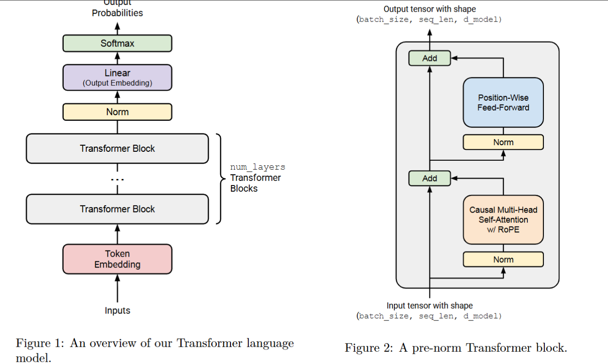

## resource(FLOPs) accounting:

#### 1. for a GPT-2 XL with params below:
vocab_size: 50257
context_length: 1024
d_model: 1600
num_layers: 48
d_ff: 6400
num_heads: 25

trainable parameters: 
vocab_size*d_model(token_embedding) + num_layers*(d_model*2 + d_model*d_model*4(Q,K,V plus output_proj)+ d_model*d_ff*3(w1,w2,w3 of FFN)) + d_model(ln_final) + vocab_size*d_model(ln_head)

required memories(single-precision):
4*#parameters

(b) Matrix Multiplies and FLOPs
矩阵乘法列表（每层）：

Q, K, V Projections: $X \in \mathbb{R}^{L \times d}, W \in \mathbb{R}^{d \times d} \to (L, d)$。3 次乘法。
Attention Scores ($QK^T$): $Q \in \mathbb{R}^{L \times d}, K^T \in \mathbb{R}^{d \times L} \to (L, L)$。
Attention Values ($AV$): $A \in \mathbb{R}^{L \times L}, V \in \mathbb{R}^{L \times d} \to (L, d)$。
Output Projection: $(L, d) \times (d, d) \to (L, d)$。
FFN W1 & W3: $X(L, d) \times W(d, d_{ff}) \to (L, d_{ff})$。2 次。
FFN W2: $(L, d_{ff}) \times (d_{ff}, d) \to (L, d)$。
Final Head: $(L, d) \times (d, V) \to (L, V)$。
FLOPs 计算: 矩阵乘法 $(M, K) \times (K, N)$ 的 FLOPs 为 $2MKN$。

Block Linear: $2L \times (4 d_{model}^2 + 3 d_{model} d_{ff}) \approx 83.9$ GFLOPs/layer。
SDPA Mechanism: $2 \times (2 L^2 d_{model}) = 4 L^2 d_{model} \approx 6.7$ GFLOPs/layer。
Total Blocks (48): $48 \times (83.9 + 6.7) \approx 4,348.8$ GFLOPs。
Head: $2 L d_{model} V \approx 164.7$ GFLOPs。
总计: 4,513.5 GFLOPs (约 4.51 TFLOPs)。

### (c) FLOPs Dominance
The **FFN (Feed-Forward Network) projections** require the most FLOPs. In our architecture, the FFN involves three large matrix multiplies projecting to a dimension $d_{ff} = 4 d_{model}$, totaling $6 \times L \times d_{model} \times d_{ff}$ FLOPs, which is significantly more than the attention projections and the quadratic attention mechanism itself at context length 1,024.

### (d) Proportional FLOPs across GPT-2 Sizes
| Model | d_model | Layers | Attn Scores (%) | FFN Proj (%) | Attn Proj (%) | Head (%) |
| :--- | :--- | :--- | :--- | :--- | :--- | :--- |
| GPT-2 Small | 768 | 12 | 11.2% | 51.5% | 17.2% | 18.2% |
| GPT-2 Medium | 1024 | 24 | 8.8% | 61.1% | 20.4% | 8.8% |
| GPT-2 Large | 1280 | 36 | 7.3% | 66.8% | 22.3% | 2.5% |
| GPT-2 XL | 1600 | 48 | 6.4% | 69.3% | 23.1% | 0.8% |

**Trend:** As the model size increases, the **Linear projections (especially FFN)** take up proportionally **more** of the total FLOPs, while the overhead of the output head and the relative cost of attention scores decrease. This is because linear projections scale with $d_{model}^2$, while attention scores and the head scale only linearly with $d_{model}$ (for a fixed context length).

### (e) Context Length Scaling (L=16,384)
When the context length is increased to 16,384, the total FLOPs for one forward pass increase significantly to approximately **86.4 TFLOPs** (a ~19x increase). In this regime, the **quadratic attention mechanism ($QK^T$ and $AV$)** becomes the dominant contributor, accounting for over **56%** of the total FLOPs per block, as it scales as $O(L^2)$ compared to the $O(L)$ scaling of the linear projections.